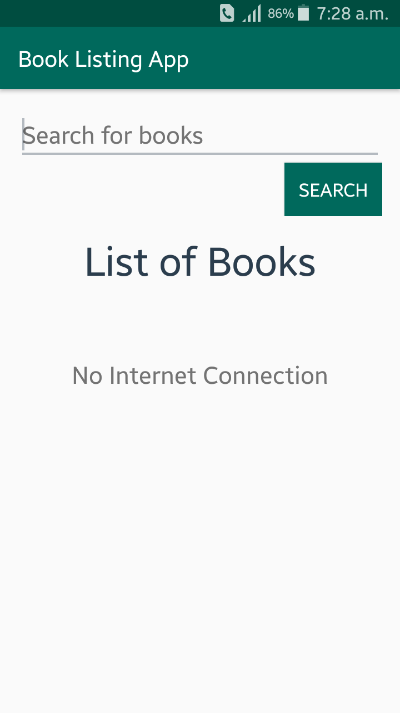
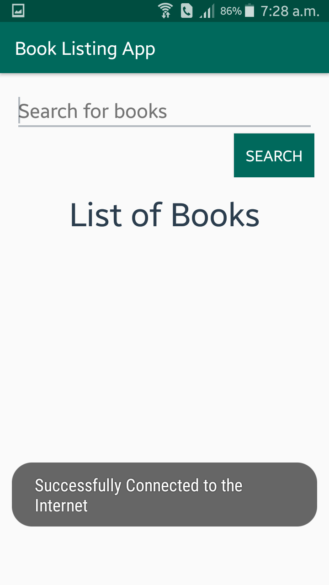
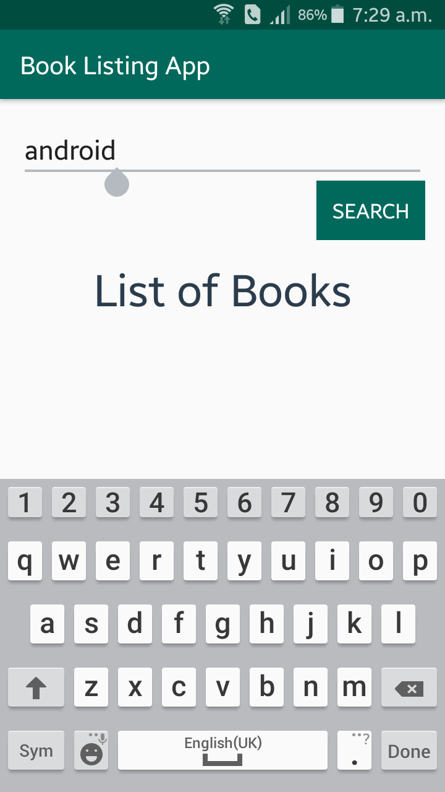
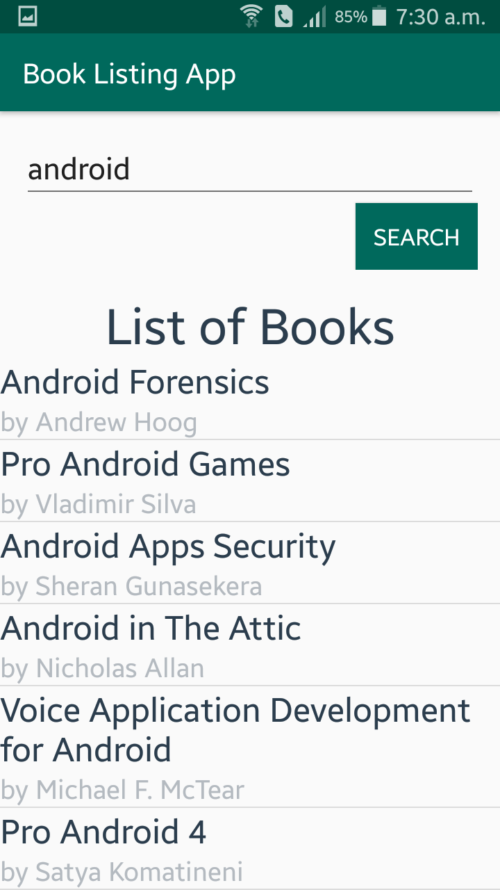
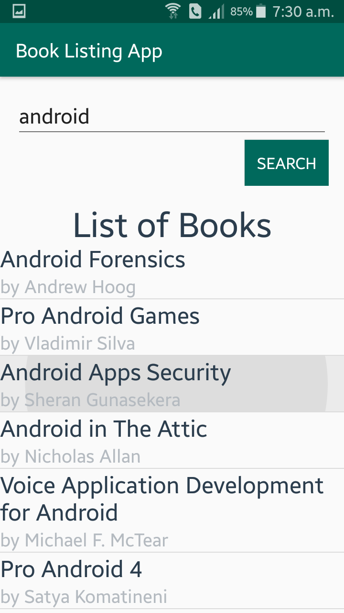
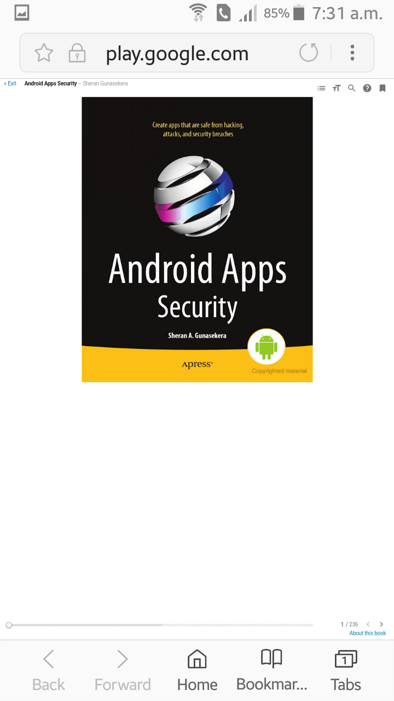

# BookListApp
BookListApp is an online application where user can search for different types of book. Then he/she can select an book which will open in the browser. User can read the book there. 

## Home Screen
This is the home screen of the application. If there is no internet connection, then it will display that "No Internet Connection"

But if the application is connected to the internet, then it show a toast message saying successfull connected.

## Search
User can search for the book they want by typing the name of the book.

## Search Result
After giving a name of the book and click on the search button, user will ses a list of books matching that name.

## Reading Book
For reading a book user have to choose one book by clicking on the book name.

Then the book will open in a browser where user can read that book.

